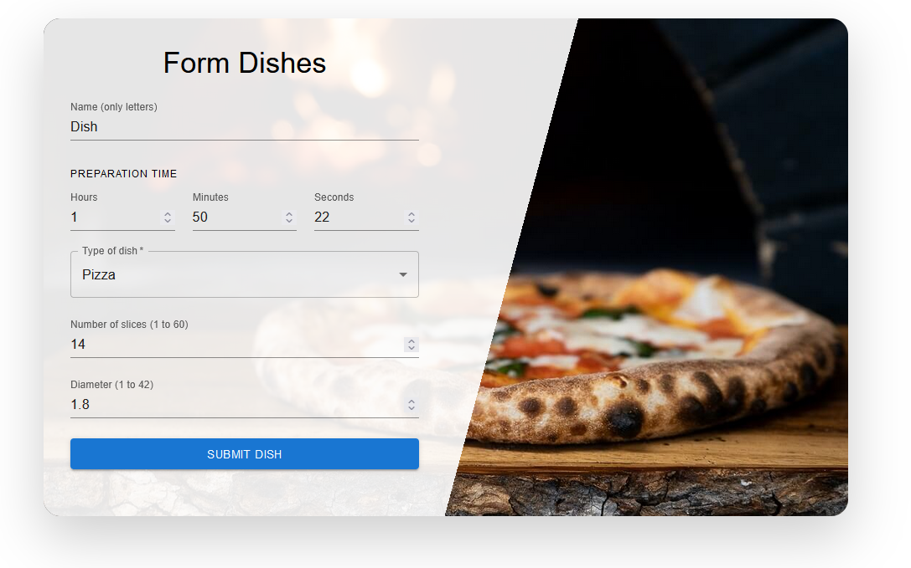
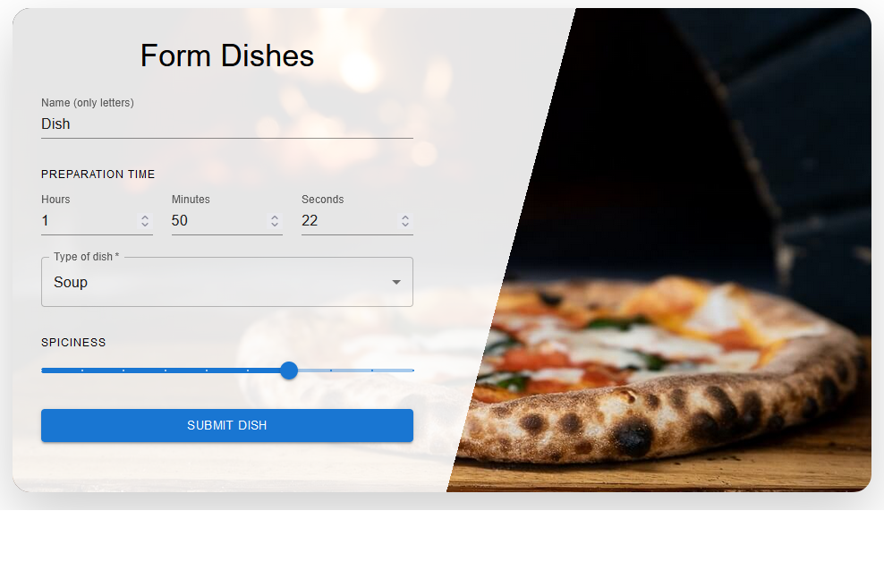
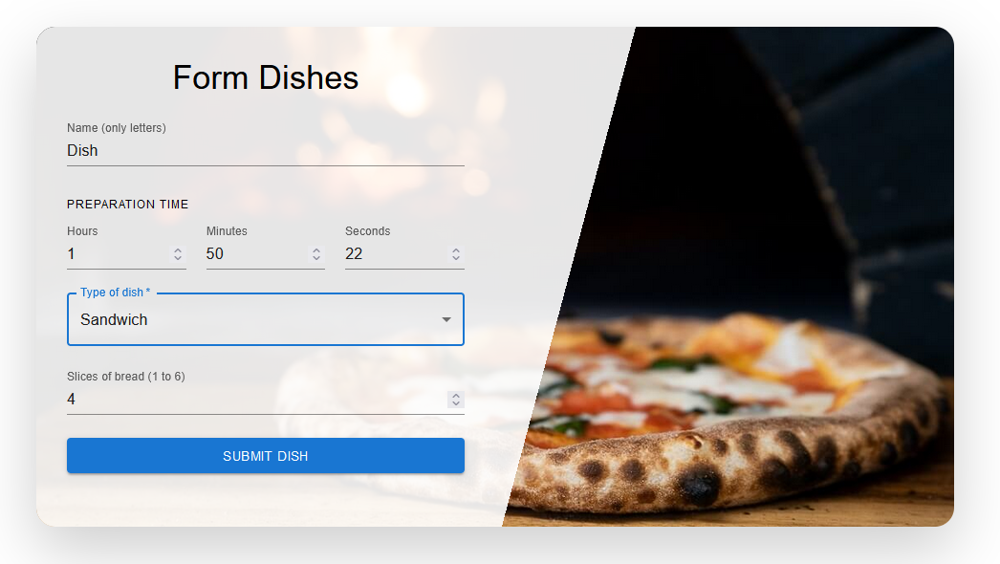
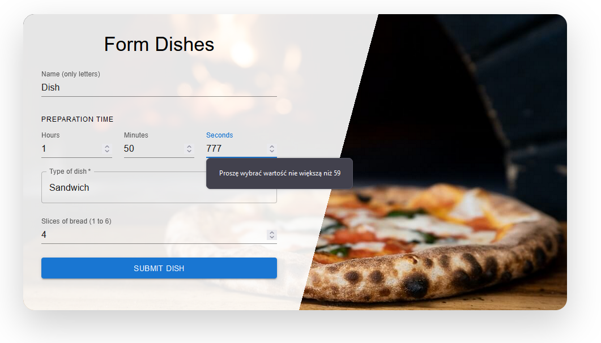
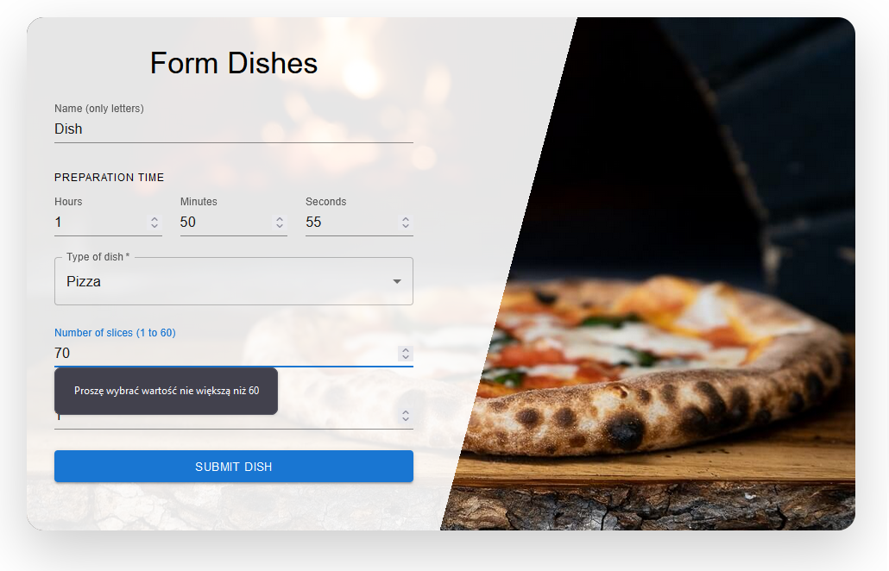
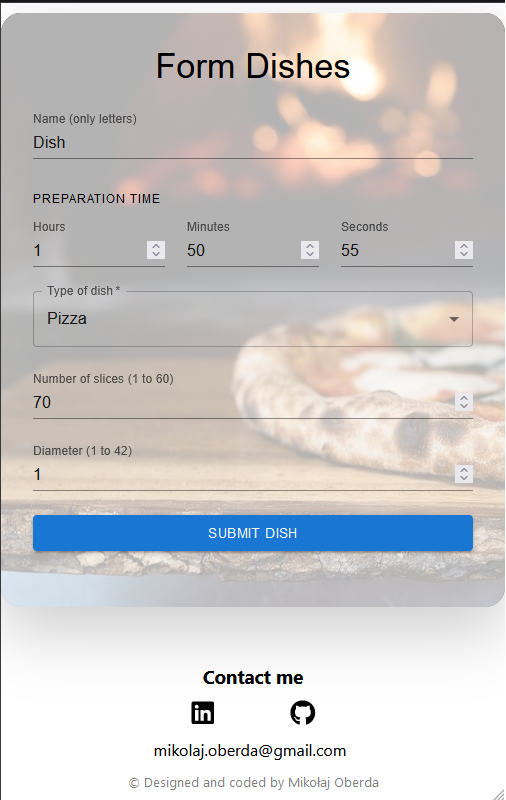

# Dishes Form

A form that allows you to create orders for selected dishes and options assigned to them, such as the number of pieces, spiciness or pizza diameter.

## ℹ️ Basic concept

The main idea behind the creation of Dishes Form was to learn about the possibilities provided by React Hook Form and MUI Components.


## 🍕🍲🥪 Types of dishes

The form allows you to place an order for pizza, soup and sandwiches. Each option has different options to choose from.





## 🗹 Validation

Thanks to the combination of MUI Components and React Hook Form, DishesForm has client-side validation, which prevents submitting incorrect data.




## 📏 Responsiveness

The application is fully responsive and adapts to the current resolution of your screen.


## Run Locally

Make sure you have Node and npm installed (https://nodejs.org/en)

Clone the project

```bash
  git clone https://github.com/dosmiko7/DishesForm
```

Go to the project directory

```bash
  cd DishesForm
```

Install dependencies

```bash
  npm install
```

Start the server

```bash
  npm run start
```

## Demo

https://form-mo.netlify.app/

## Tech Stack

- Node v18.14.2
- npm v9.5.0
- React,
- TypeScript,
- SCSS,
- MUI Components,
- React Form Hook,
- Axios

## Author

Mikołaj Oberda
[@dosmiko7](https://www.github.com/dosmiko7)
